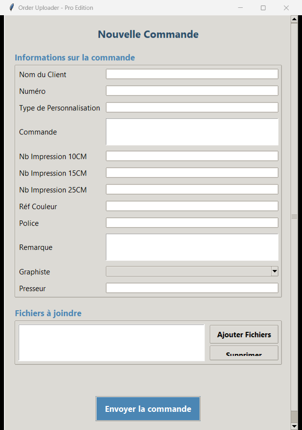
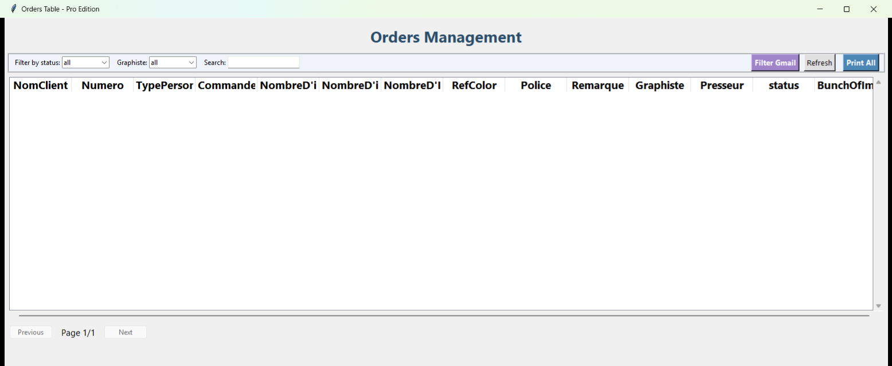
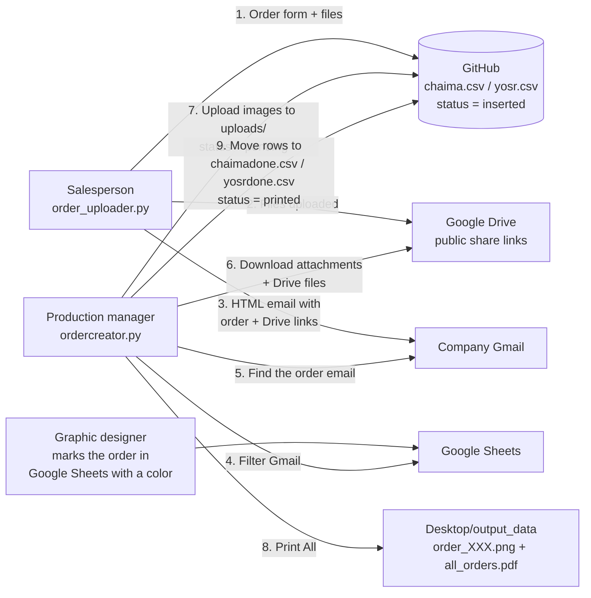

# Order Creator — Order Management Suite

> **This project was built for the company Tenue Pro**, which sells custom clothing (t-shirts, hoodies, caps, aprons…) with **printing (Impression)** and **embroidery (Broderie)**.

Order Creator is a set of two Python desktop apps that handle the whole life of a customer order at Tenue Pro, from the moment a salesperson takes it to the moment it is printed in the workshop:

| App | File | Who uses it | Role |
|---|---|---|---|
| **Order Uploader – Pro Edition** | [`order_uploader.py`](order_uploader.py) | Sales / customer service | Enter a new order, attach the customer's design files, email it to the team and save it. |
| **Orders Table – Pro Edition** | [`ordercreator.py`](ordercreator.py) | Production manager / workshop | View every order, pull the design files from Gmail and Drive, and generate printable production sheets (PNG + PDF). |

Both apps use a **GitHub repository as a shared online database**. Orders are stored there as CSV files and design images in an `uploads/` folder, so every computer in the company sees the same data.

---

## Table of contents

1. [Screenshots](#screenshots)
2. [Overall workflow](#overall-workflow)
3. [Data storage (GitHub as a database)](#data-storage-github-as-a-database)
4. [App 1 — `order_uploader.py`](#app-1--order_uploaderpy)
5. [App 2 — `ordercreator.py`](#app-2--ordercreatorpy)
6. [Automatic creation of missing files](#automatic-creation-of-missing-files)
7. [Version control / forced updates](#version-control--forced-updates)
8. [Installation](#installation)
9. [Configuration](#configuration)
10. [Running the apps](#running-the-apps)
11. [Building Windows executables](#building-windows-executables)
12. [Project structure](#project-structure)
13. [Troubleshooting](#troubleshooting)
14. [Security notes](#security-notes)

---

## Screenshots

### Order Uploader – entering a new order


### Orders Table – order management dashboard


> The table is empty in this screenshot because it was taken without valid GitHub credentials. With a valid token it lists every order, color-coded by status.

---

## Overall workflow



### Order status lifecycle

| Status | Set by | Meaning |
|---|---|---|
| `inserted` | Order Uploader | The order was entered and emailed. Its design files are still only on Google Drive. |
| `pending` | Orders Table → **Filter Gmail** | The designer has validated the order (colored cell in Google Sheets) and its images are now in `uploads/`. Ready to print. Shown in **purple**. |
| `printed` | Orders Table → **Print All** | The production sheet was generated. The row moved to the `*done.csv` archive. Shown in **green**. |

Each order belongs to one of the two graphic designers (**Graphiste**): **Chaima** or **Yosr**. Each designer has her own active CSV and her own archive CSV.

---

## Data storage (GitHub as a database)

Every read and write goes through the GitHub REST API (`/repos/{owner}/{repo}/contents/{path}`). Nothing is read from local CSV files.

| Path in the repo | Content |
|---|---|
| `chaima.csv` | Active orders for designer Chaima (`inserted` / `pending`) |
| `yosr.csv` | Active orders for designer Yosr (`inserted` / `pending`) |
| `chaimadone.csv` | Archive of Chaima's printed orders |
| `yosrdone.csv` | Archive of Yosr's printed orders |
| `uploads/` | Design images and files linked to orders |
| `versionordercreator.txt` | Required version of **Order Uploader** (e.g. `1.0.7`) |
| `versionorderextractor.txt` | Required version of **Orders Table** (e.g. `1.0.4`) |
| `filtered_emails.csv` | (optional) Output of the legacy "filter and save" helper |

### CSV columns

All order CSVs share this exact header:

| Column | Description |
|---|---|
| `NomClient` | Customer name |
| `Numero` | Customer phone number. Used as the **unique order key**. |
| `TypePersonnalisation` | Personalization type (Impression / Broderie…) |
| `Commande` | Ordered items (multi-line, e.g. `3 x T-shirt Noir M`) |
| `NombreD'impression10CM` | Number of 10 cm prints |
| `NombreD'impression15CM` | Number of 15 cm prints |
| `NombreD'Impression25CM` | Number of 25 cm prints |
| `RefColor` | Color reference of the logo |
| `Police` | Font used for the logo / text |
| `Remarque` | Free notes |
| `Graphiste` | Designer: `Chaima` or `Yosr` |
| `Presseur` | Press operator |
| `status` | `inserted`, `pending` or `printed` |
| `BunchOfPhotos` | Comma-separated names of the images in `uploads/` |

---

## App 1 — `order_uploader.py`

**Window title:** *Order Uploader - Pro Edition* (600×900, scrollable)

### What the user sees

- **Informations sur la commande** is the order form with every field listed above. `Commande` and `Remarque` are multi-line boxes. `Graphiste` is a drop-down (Chaima / Yosr).
- **Fichiers à joindre** is the list of attached files:
  - **Ajouter Fichiers** opens a file picker (any file type: `.jpg`, `.png`, `.ai`, …).
  - **Supprimer** removes the selected files from the list.
- **Envoyer la commande** submits the order.
- A **status line** shows progress (green) or errors (red).

### What happens when you click "Envoyer la commande"

1. **Validation.** A designer must be selected, and `Nom du Client` and `Numéro` are required.
2. The form is **cleared right away**, so the salesperson can type the next order while this one is processed **in a background thread**.
3. **Google Drive upload** (`upload_and_share_drive`). Each attached file is uploaded to Google Drive and shared as *"anyone with the link can view"*.
4. **Email** (`send_order_email`). An HTML email titled `"<NomClient> (<Numero>)"` is sent from the company Gmail to itself through SMTP SSL (port 465). It contains:
   - a styled table with every field of the order
   - the list of Google Drive links for the attached files
5. **Saving to GitHub** (`insert_order`). The order is appended to `chaima.csv` or `yosr.csv` with `status = inserted` and an empty `BunchOfPhotos`. The files themselves are **not** uploaded to GitHub at this step.
6. **Delivery check** (`verify_and_resend_if_needed`). Through the Gmail API (read-only), the app looks for the most recent email whose subject contains the phone number. It then compares that email's HTML with the one just sent. If the email is missing or different, it **sends it again and saves it again**.
7. **Automatic retry.** If any step fails (network, SSL, timeout…), the whole process is retried every **10 seconds** until it succeeds. The error is shown in the status line.

### Main functions

| Function | Purpose |
|---|---|
| `ensure_github_files_exist()` | Creates any missing CSV, TXT or `uploads/` entries in the repo at startup |
| `get_github_file_content(path)` | Downloads a raw file from the repo (600 s timeout, clear French error messages) |
| `update_github_file_content(path, content, message)` | Creates or updates a file in the repo (handles the `sha`) |
| `upload_file_to_github(...)` | Uploads a binary file to `uploads/` with a unique name (name + phone + timestamp + random + SHA-256). Not used by the current flow. |
| `load_csv_from_github` / `save_csv_to_github` | Read and write a CSV as a list of dicts |
| `insert_order(order_data, file_paths)` | Adds the order to the right designer's CSV |
| `authenticate_drive()` / `upload_and_share_drive()` | Google Drive OAuth and public sharing |
| `send_order_email(...)` | Builds and sends the HTML email |
| `authenticate_gmail()` / `get_most_recent_email_by_numero()` / `email_matches_order()` | Delivery check through the Gmail API |
| `run_ui()` | Builds the Tkinter interface |

### Local files it creates

| File | Purpose |
|---|---|
| `token.json` | Saved Google Drive OAuth token |
| `gmail_token_uploader.pickle` | Saved Gmail OAuth token (used for the delivery check) |

---

## App 2 — `ordercreator.py`

**Window title:** *Orders Table - Pro Edition*

### What the user sees

- **Orders Management** is a table of every active order (`chaima.csv` + `yosr.csv`). Each row is colored by status: **purple** for `pending`, **green** for `printed`.
- **Filters:**
  - *Filter by status*: `all` / `pending` / `printed`
  - *Graphiste*: `all` / `chaima` / `yosr`
  - *Search*: live, case-insensitive search across every column except the photo column
- **Pagination.** 9 orders per page, with *Previous* / *Next*.
- **Buttons:**
  - **Filter Gmail** collects the design files of validated orders (see below).
  - **Refresh** reloads the CSVs from GitHub.
  - **Print All** generates the production sheets for every `pending` order.

### "Filter Gmail" — `process_and_update_rows_from_csvs()`

This step links the order to the work the designers track in **Google Sheets**. Each designer has her own spreadsheet. When an order is validated, she **colors the customer-name cell** (column B).

For each row of `chaima.csv` and `yosr.csv` whose status is `inserted`:

1. Find the customer's phone number in the designer's Google Sheet. The search starts from the bottom, using column **E** for Chaima and column **I** for Yosr.
2. Check the background color of the name cell with `is_purple_color()`. These colors count as "validated":
   - purple / mauve `RGB(0.76, 0.48, 0.63)` (±0.03 tolerance)
   - pure red `{'red': 1}`
   - a specific green `RGB(0.20, 0.66, 0.33)`
3. If the order is validated, search Gmail for the most recent email containing the phone number.
4. Download the email's **attachments** and every **Google Drive file** linked in its body (links are found with regex and BeautifulSoup).
5. Upload each file to `uploads/` on GitHub as `<NomClient>_<phone>_<random6>.<ext>`, with the name cleaned up.
6. Update the row: `status = pending` and `BunchOfPhotos = file1,file2,…`.
7. Save the updated CSV to GitHub.

### "Print All" — production sheets

For every `pending` order:

1. The output folder **`Desktop/output_data/`** is **emptied and recreated**.
2. Every image used by these orders (`.jpg`, `.jpeg`, `.png`, `.bmp`) is downloaded **once** from `uploads/`. Each one is resized to at most 600 px and cached in a temporary folder.
3. One sheet is built per order as an **A4 landscape PNG (3508×2480 px)** (`add_entry_to_image`):
   - **left side:** a table with Nom Client, Numéro, Type Perso, Commande, Nombre Impression (10/15/25 cm), Réf Couleur, Police, Remarque, Graphiste, Presseur. Long orders (more than 10 lines) are shown as pairs, `line1 || line2`.
   - **right side:** the design images, laid out in a grid sized to make them as large as possible.
   - saved as `order_<Numero>.png`
4. All the PNGs are merged into **`all_orders.pdf`**, ready to print.
5. The orders are marked `printed` (`update_status_and_move`):
   - they are removed from `chaima.csv` / `yosr.csv`
   - they are appended to `chaimadone.csv` / `yosrdone.csv`
   - all four CSVs are rewritten with the same fixed set of columns
6. The table refreshes and a message shows where the images and PDF were saved.

While this runs, a progress window (*"Veuillez patienter"*) stays open and the work happens in a background thread.

### Other components in the file

| Component | Description |
|---|---|
| `PDF(FPDF)` + `FabricationApp` | Older "Fabrication Form" window that generates a single PDF production order with images, saved to the Desktop. It needs `DejaVuSans.ttf`. The current entry point doesn't open it. |
| `filter_and_save_to_github()` | Older helper. It takes the phone numbers of colored rows in the sheets, finds the matching emails, and saves `filtered_emails.csv` to GitHub. |
| `extract_numbers_from_sheets_to_csv()` | Test helper that exports the validated phone numbers to `Desktop/sheet_numbers.csv` |
| `extract_yosr_line_5431_phone_and_gmail_to_csv()` | Debug helper for one specific row of Yosr's sheet |
| Startup debug block | Prints row 3199 of Chaima's sheet and its color check to the console |

### Local files it uses or creates

| File | Purpose |
|---|---|
| `service_account.json` | Google **service account** key (read-only access to Sheets) |
| `client_secret.json` | Google OAuth client (Gmail) |
| `gmail_token.pickle` | Saved Gmail OAuth token |
| `Desktop/output_data/` | Generated `order_*.png` and `all_orders.pdf` |

---

## Automatic creation of missing files

On startup, **before anything else** (even the version check), both apps call `ensure_github_files_exist()`. For each required path, it checks whether the file exists in the GitHub repo. If GitHub answers **404**, it creates the file:

| Path | Default content |
|---|---|
| `chaima.csv`, `yosr.csv`, `chaimadone.csv`, `yosrdone.csv` | Header line only |
| `versionordercreator.txt` | `1.0.7` |
| `versionorderextractor.txt` | `1.0.4` |
| `uploads/.gitkeep` | Empty. GitHub can't store empty folders, so this file creates `uploads/`. |

Files that already exist are never changed. If GitHub can't be reached, the app prints a message and starts normally.

---

## Version control / forced updates

Each app compares its own version with the one stored on GitHub:

| App | Remote file | Built-in version |
|---|---|---|
| Order Uploader | `versionordercreator.txt` | `1.0.7` |
| Orders Table | `versionorderextractor.txt` | `1.0.4` |

If the versions differ, the app shows **"Mise à jour requise"** (update required), opens the Google Drive folder that holds the new installer, and closes. If the file can't be read, the app runs anyway.

**To force every employee to update:** release the new executable, then change the number in the matching `.txt` file on GitHub.

---

## Installation

### Requirements

- Windows (the apps use the `arial.ttf` system font and save to the Desktop)
- Python **3.10+** with Tkinter (included in the standard Windows installer)
- A Google Cloud project with the **Gmail API**, **Google Drive API** and **Google Sheets API** enabled
- A GitHub repository and a fine-grained token with **Contents: Read and write** access

### Python dependencies

```bash
pip install fpdf pillow requests beautifulsoup4 httplib2 \
            google-api-python-client google-auth google-auth-oauthlib
```

> `fpdf` (1.x) is only needed by the older `FabricationApp`, but it is imported when the app starts, so it must be installed.

---

## Configuration

All settings are loaded from environment variables. Copy `.env.example` → `.env` and fill in your values (see [Security notes](#security-notes) for the full list). The JSON credential files below must be placed in the same folder as the scripts:

| File | File(s) that use it | Description |
|---|---|---|
| `client_secret.json` | both | Google OAuth client (Drive + Gmail). Rename your downloaded file to this. |
| `service_account.json` | `ordercreator.py` | Google service account key (read-only Sheets access). Share both spreadsheets with this account's email. |
| `GMAIL_OAUTH_CLIENT_FILE` | `ordercreator.py` | Google OAuth client JSON (Gmail) |
| `SHEET_IDS` | `ordercreator.py` | IDs of the two Google Sheets: `[Chaima, Yosr]` |

Put the Google JSON key files **in the same folder as the scripts**, and run the scripts from that folder. The first time Gmail or Drive is used, a browser window opens so you can sign in to Google. The token is then saved locally.

---

## Running the apps

```bash
# Sales: enter new orders
python order_uploader.py

# Production: manage, collect files and print
python ordercreator.py
```

---

## Building Windows executables

The code supports being packaged as an executable (`sys.frozen` is handled in `get_exe_dir()`). For example, with PyInstaller:

```bash
pip install pyinstaller
pyinstaller --onefile --windowed --name "OrderUploader" order_uploader.py
pyinstaller --onefile --windowed --name "OrderCreator"  ordercreator.py
```

Put the Google JSON key files next to the generated `.exe`.

---

## Project structure

```
ordercreator-main/
├── order_uploader.py          # App 1 – order entry, email, Drive upload
├── ordercreator.py            # App 2 – order dashboard, Gmail extraction, printing
├── screenshots/               # README screenshots
└── README.md
```

The data files (`chaima.csv`, `yosr.csv`, `chaimadone.csv`, `yosrdone.csv`, `versionordercreator.txt`, `versionorderextractor.txt`) and the `uploads/` folder are not stored in this repository. Both apps create them automatically in the GitHub data repository on first launch (see [Automatic creation of missing files](#automatic-creation-of-missing-files)).

---

## Troubleshooting

| Symptom | Cause / fix |
|---|---|
| `401 Client Error: Unauthorized` in the console, empty table | The GitHub token is invalid, expired or revoked. Create a new one. |
| `No such file or directory: 'ordersmanagers-…json'` | The Sheets service account key is missing from the working folder |
| "Mise à jour requise" at startup | The version on GitHub doesn't match the app. Install the new version. |
| Email not sent / SMTP error | Check `GMAIL_APP_PASSWORD` (2-step verification must be on to create an App Password) |
| An order never becomes `pending` | The name cell in Google Sheets isn't one of the recognized colors, the phone number doesn't match exactly, or no email contains that number |
| An image is missing from the sheet | Only `.jpg/.jpeg/.png/.bmp` are placed on sheets. `.ai` files are stored but not drawn. |
| `output_data` was cleared | This is expected. **Print All** empties `Desktop/output_data/` every time it runs. |

---

## Security notes

All credentials are loaded from **environment variables** — nothing is hardcoded in the source code. Copy `.env.example` to `.env`, fill in your values, and install `python-dotenv`:

```bash
pip install python-dotenv
```

The apps will pick up the values automatically. `.env` is listed in `.gitignore` and will never be committed.

### Required variables

| Variable | Description |
|---|---|
| `GITHUB_TOKEN` | Personal access token with **Contents: read & write** on the data repo |
| `GITHUB_OWNER` | GitHub username that owns the data repo |
| `GITHUB_REPO` | Name of the data repo (default: `ordercreator`) |
| `GMAIL_ADDRESS` | Gmail address used to send order emails |
| `GMAIL_APP_PASSWORD` | [Gmail App Password](https://myaccount.google.com/apppasswords) (requires 2-Step Verification) |
| `CHAIMA_SHEET_ID` | ID of Chaima's Google Sheet (the long string in the spreadsheet URL) |
| `YOSR_SHEET_ID` | ID of Yosr's Google Sheet |

### Other things to keep private

- `service_account.json` and `client_secret.json` — blocked by `.gitignore` (`*.json`)
- `gmail_token.pickle`, `token.json` — blocked by `.gitignore` (`*.pickle`, `*.json`)
- The **data repository** (`GITHUB_REPO`) should be kept **private** on GitHub — it holds customer orders and design images.

---

*Built for **Tenue Pro**: custom printing and embroidery on clothing.*
